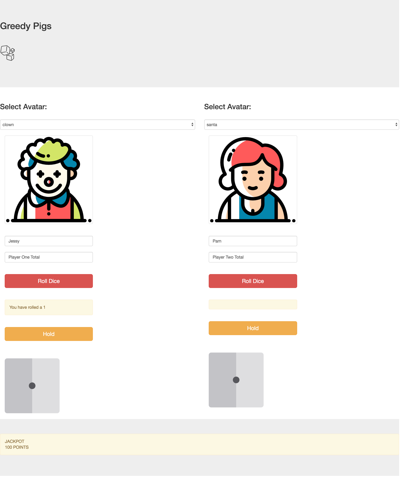

## Greedy Pigs.

## Description
[Greedy Pigs](https://tc-mwangi.github.io/pig-dice/) is a 2-player dice game of chance and expectation, greed and strategy.

## Screenshots

### Homepage

## Live Site

Try your hand at the game - [Greedy Pigs](https://tc-mwangi.github.io/pig-dice/).

## Built With

* [Atom](https://atom.io/) - Text editor.
* [Boostrap](https://getbootstrap.com/) - Content library.
* [jQuery](https://jquery.com/) - Javascript library.
* [Owl Carousel](https://owlcarousel2.github.io/OwlCarousel2/) - jQuery plugin.
* [wow.JS](https://wowjs.uk/) - jQuery plugin.

## Behavior Driven Development (BDD)

| User Inputs  | Example Outputs  |
|----          |       :---|
| When it receives:    | It should return:|
|          | |                        
| User clicks "Play". | User is taken to the game console.  |
| Player "Rolls" dice. | Dice face displays a random number from 1-6.  |
| Player rolls a number from 2-6. | The number is added to Player's present score, Player may roll dice again. |
| Player rolls a 1.  | The player's present score displays 0, Console displays "too bad!", Play moves to next Player.  |  
| Player holds/chooses to forfeit roll.  | Points for the round are added to Player's total counter, Play moves to next Player.  |
|  Player's total score is >== 100  | Player wins the game, game play is disabled, Console displays "Player " " wins!".  |
| When player 1 is playing.  | Player 2 cannot Play, Player 2's console is disabled.  |  
| When Player 2 is playing.  |  Player 1 cannot Play, Player 2's console is disabled. |
| User clicks "New Game".  | Game is reset/refreshed, Both counters display 0, Prompt player 1 to start.  |
| Optional Rules  |
| Player rolls a hat-trick (three "6's" in a row)  | The player's present score displays 0, Console displays "too bad!", Play moves to next Player.
| Limit the number of rounds to 10  | Game ends after the set number of rounds  |

## Contributing

Pull requests are welcome. For major changes, please open an issue first to discuss what you would like to change.

Please make sure to update tests as appropriate.

## Authors

* **Loise Mwangi** - *Initial work* - [greedy pigs](https://github.com/tc-mwangi/pig-dice)

## Acknowledgments

* [Flaticon](https://www.flaticon.com) - Avatar and dice images used.
* [Pencimation](https://www.youtube.com/channel/UCUAL--p3qAa27luR0IYbjZA) - The animated video used.

## License

This project is licensed under the MIT License - see the [LICENSE.md](https://github.com/tc-mwangi/pig-dice/blob/master/LICENSE) file for details
